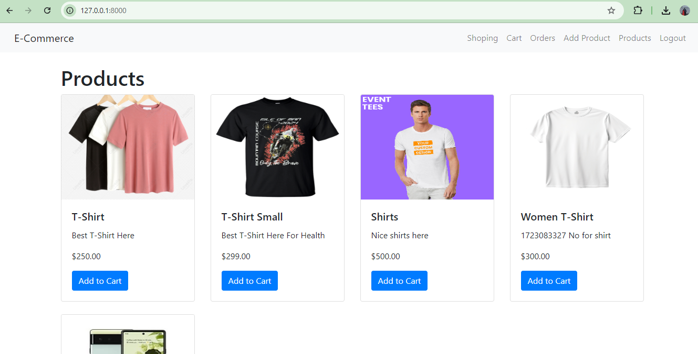
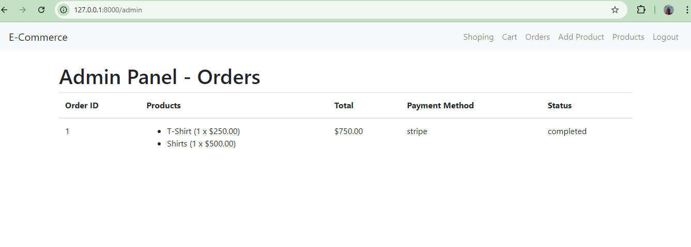
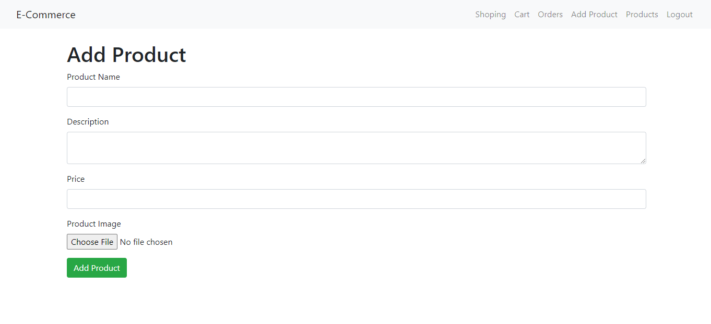
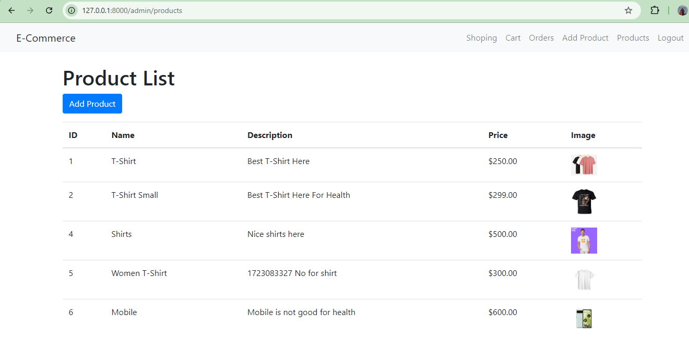

## Requirement
1. PHP 8.1 [Minium]
2. Mysql
3. Apache

## Database setup
1. import dataBaseScript.sql file. [File in the root directory]

## Setup project
1. composer install
2. php artisan serve

## Admin Login
Url - http://127.0.0.1:8000/login   [Normal user can also login]
Username - pawankum0010@gmail.com
Password - Bsa@123456

## Customer Can Signup/Login
http://127.0.0.1:8000/register
http://127.0.0.1:8000/login

## Admin Work
1. Add product [http://127.0.0.1:8000/admin/products/create]
2. Order Listing [http://127.0.0.1:8000/admin]

 ## Test
 php artisan test
